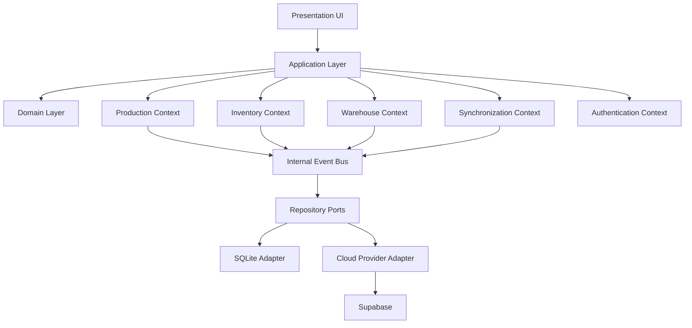
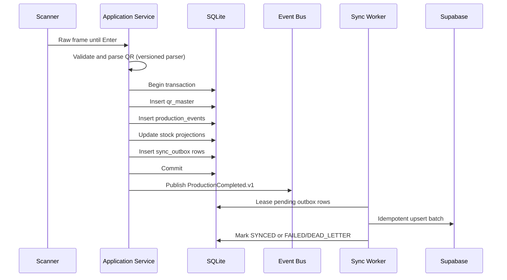
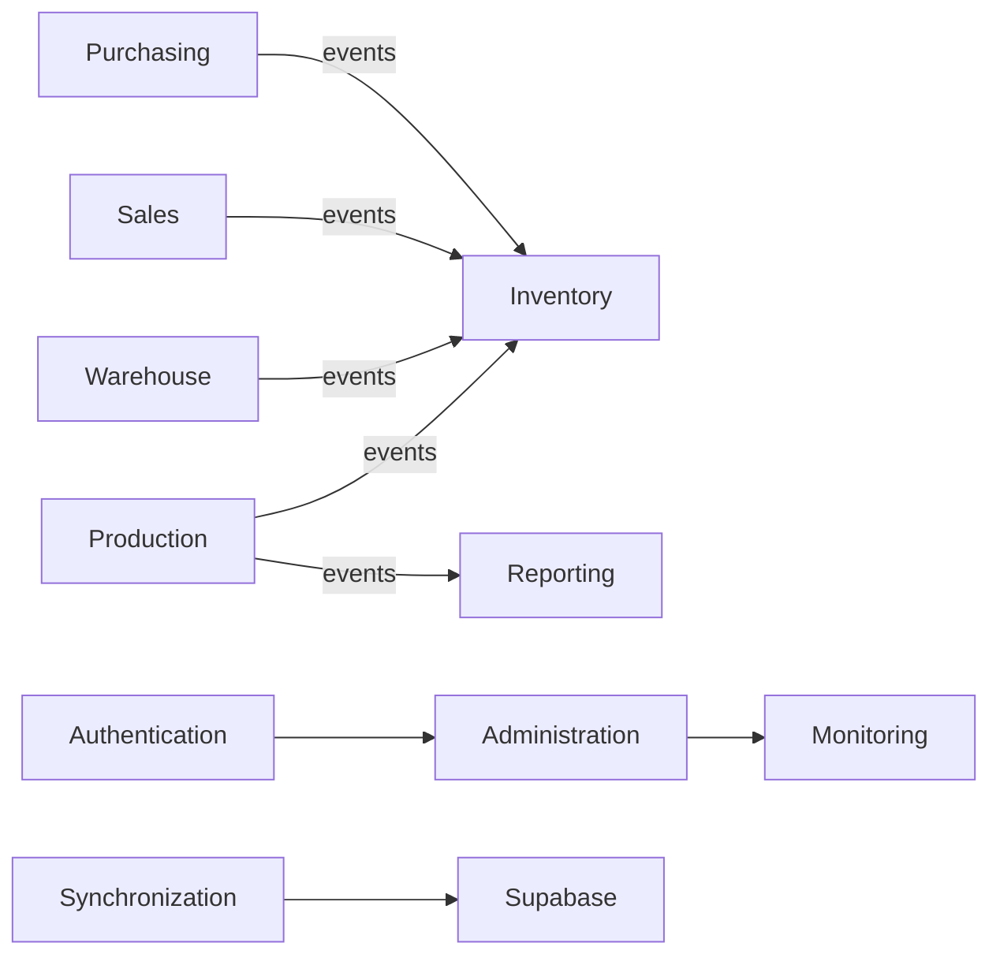
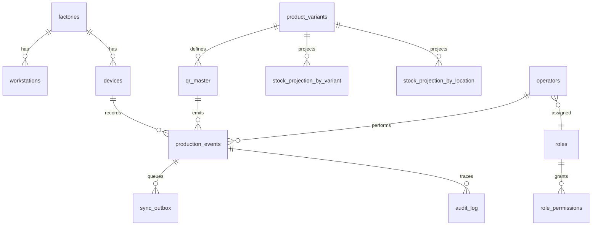

# Architecture Diagrams

## Module Dependency Graph

```mermaid
graph TD
  UI[Presentation UI] --> APP[Application Layer]
  APP --> DOM[Domain Layer]
  APP --> PROD[Production Context]
  APP --> INV[Inventory Context]
  APP --> WH[Warehouse Context]
  APP --> SYNC[Synchronization Context]
  APP --> AUTH[Authentication Context]
  PROD --> BUS[Internal Event Bus]
  INV --> BUS
  WH --> BUS
  SYNC --> BUS
  BUS --> REPO[Repository Ports]
  REPO --> SQL[SQLite Adapter]
  REPO --> CLOUD[Cloud Provider Adapter]
  CLOUD --> SUPA[Supabase]
```

## Scan-to-Sync Sequence

```mermaid
sequenceDiagram
  participant Scanner
  participant AppService as Application Service
  participant DB as SQLite
  participant Bus as Event Bus
  participant Outbox as Sync Worker
  participant Cloud as Supabase

  Scanner->>AppService: Raw frame until Enter
  AppService->>AppService: Validate and parse QR (versioned parser)
  AppService->>DB: Begin transaction
  AppService->>DB: Insert qr_master
  AppService->>DB: Insert production_events
  AppService->>DB: Update stock projections
  AppService->>DB: Insert sync_outbox rows
  AppService->>DB: Commit
  AppService->>Bus: Publish ProductionCompleted.v1
  Outbox->>DB: Lease pending outbox rows
  Outbox->>Cloud: Idempotent upsert batch
  Outbox->>DB: Mark SYNCED or FAILED/DEAD_LETTER
```

## Context Map

```mermaid
graph LR
  PROD[Production] -->|events| INV[Inventory]
  PROD -->|events| REP[Reporting]
  WH[Warehouse] -->|events| INV
  SALES[Sales] -->|events| INV
  PUR[Purchasing] -->|events| INV
  AUTH[Authentication] --> ADMIN[Administration]
  SYNC[Synchronization] --> CLOUD[Supabase]
  ADMIN --> MON[Monitoring]
```

## High-Level Data Model

```mermaid
erDiagram
  factories ||--o{ workstations : has
  factories ||--o{ devices : has
  product_variants ||--o{ qr_master : defines
  qr_master ||--o{ production_events : emits
  product_variants ||--o{ stock_projection_by_variant : projects
  product_variants ||--o{ stock_projection_by_location : projects
  production_events ||--o{ sync_outbox : queues
  operators ||--o{ production_events : performs
  devices ||--o{ production_events : records
  roles ||--o{ role_permissions : grants
  operators }o--|| roles : assigned
  production_events ||--o{ audit_log : traces
```
